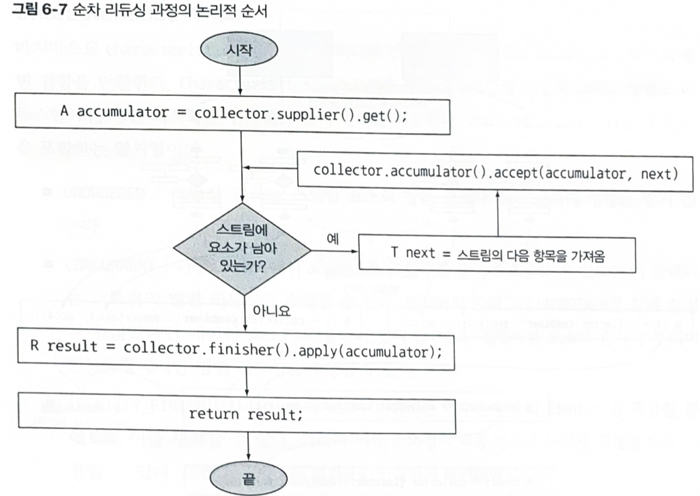

# 스트림으로 데이터 수집

해당 Chapter의 목표는 4장, 5장에서는 최종 연산 collect만을 사용햇는데, 이를 다양한 방식으로
사용할 수 있도록 돕는 것을 목표로 합니다.


명령형 버전의 경우엔 문제를 해결하기 위해 다중 루프와 조건문을 추가하기 때문에 가독성이 떨어지지만
선언 방식을 통해 가독성을 높여 유지보수성을 늘릴 수 있다.

해당 장의 학습을 통해 통화별로 트랜잭션 리스트를 그룹화하라는 식으로 코드를 명령형이 아닌
선언형으로 짤 수 있다. 아래는 그 예시이다.

```Java
Map<Currency, List<Transaction>> transactionsByCurrencies
                = transactions.stream()
                              .collect(groupingBy(Transaction::getCurrency));
```

### 6.1.2 미리 정의된 컬렉터

Collectors에서 제공하는 메서드의 기능은 크게 세 가지로 구분이 가능하다.
- 스트림 요소를 하나의 값으로 리듀스하고 요약
- 요소 그룹화
- 요소 분할

※ 주의할 사항<br>
Collection, Collector, Collect를 혼동하지 않고 살펴 볼 것!

collect: 스트림 연산의 최종 연산 메서드 중 하나
collector: collect에서 필요한 메서드들을 정의해놓은 인터페이스
collectors: collector를 구현한 클래스들을 제공

Collector 내의 인터페이스 종류

```Java
import java.util.function.BinaryOperator;
import java.util.function.Supplier;

public interface Collector<T, A, R> {
    Supplier<A> supplier();
    BiConsumer<A, T> accumulator();
    BinaryOperator<A> combiner();
    Function<A,R> finisher();
    Set<Characteristics> characteristics();
}
```

Collectors 클래스는 미리 Collector를 구현한 클래스 5가지 종류
- 변환 : mapping(), toList(), toMap(), toCollection(), ...
- 통계 : counting(), summingInt(), averagingInt(), maxBy(), minBy(), summarizingInt(),
- 문자열 결합 : joining()
- 리듀싱 : reducing()
- 그룹화와 분할 : groupingBy(), partitioningBy(), collectingAndThen()

---

## 6.2 리듀싱과 요약

리듀싱 관련 요소를 직접적으로 보여주는 것보다는 연습용 자료로 쓰는 게 좋을 것 같다 생각
해서 질의로 바꿔봤습니다.

Dish, menu, type 구성
```Java
public class Dish {

    private final String name;
    private final boolean vegetarian;
    private final int calories;
    private final Type type;

    public Dish(String name, boolean vegetarian, int calories, Type type) {
        this.name = name;
        this.vegetarian = vegetarian;
        this.calories = calories;
        this.type = type;
    }

    public String getName() {
        return name;
    }

    public boolean isVegetarian() {
        return vegetarian;
    }

    public int getCalories() {
        return calories;
    }

    public Type getType() {
        return type;
    }

    @Override
    public String toString(){
        return name;
    }


    public enum Type {
        MEAT,
        FISH,
        OTHER
    }

    public static final List<Dish> menu = asList(
            new Dish("pork", false, 800, Type.MEAT),
            new Dish("beef", false, 700, Type.MEAT),
            new Dish("chicken", false, 400, Type.MEAT),
            new Dish("french fries", true, 530, Type.OTHER),
            new Dish("rice", true, 350, Type.OTHER),
            new Dish("season fruit", true, 120, Type.OTHER),
            new Dish("pizza", true, 550, Type.OTHER),
            new Dish("prawns", false, 400, Type.FISH),
            new Dish("salmon", false, 450, Type.FISH)
    );

    public static final Map<String, List<String>> dishTags = new HashMap<>();

    static {
        dishTags.put("pork", asList("greasy", "salty"));
        dishTags.put("beef", asList("salty", "roasted"));
        dishTags.put("chicken", asList("fried", "crisp"));
        dishTags.put("french fries", asList("greasy", "fried"));
        dishTags.put("rice", asList("light", "natural"));
        dishTags.put("season fruit", asList("fresh", "natural"));
        dishTags.put("pizza", asList("tasty", "salty"));
        dishTags.put("prawns", asList("tasty", "roasted"));
        dishTags.put("salmon", asList("delicious", "fresh"));
    }
}
```

1. 요리의 개수를 구하시오.(counting)


2. 요리 중 가장 높은 칼로리를 가진 요리를 구하시오.(maxBy, comparingInt)


3. menu에 있는 요리의 총 칼로리를 구하시오.(summingInt)


4. menu에 있는 요리의 카롤리 평균을 구하시오.(averagingInt)


5. menu에 있는 요소 수, 요리의 칼로리 합계, 평균, 최댓값, 최솟값을 보여주는 IntSummaryStatistics로 반환하시오.


6. 요리의 이름을 스페이스를 구분자로 합쳐 문자열로 반환하시오.


7. 요리의 이름을 ,를 구분자로 합쳐 문자열로 반환하시오.

### 6.2.4 범용 리듀싱 요약 연산

앞의 예제들은 모두 reducing 팩토리 메서드를 통해서 구현을 할 수 있는데, 특화된 컬렉터를 앞처럼
사용하면 더 코드를 간단하게 구현할 수 있다.

reducing은 인수를 3개를 받으며 세 개의 인수는 아래와 같다.
- 첫 번째 인수: 리듀싱 연산의 시작 값 혹은 인수가 없을 땐 반환 값
- 두 번째 인수: 요소 변환 함수
- 세 번째 인수: 같은 종류!!!의 두 항목을 하나의 값으로 더하는 BinaryOperator

만약에 한 개의 인수를 갖는 경우엔 스트림의 첫 번째 요소를 시작 요소로, 두 번째 요소는
자기 자신을 반환하는 항등 함수, 세번째 요소는 받아온다.

1. 가장 칼로리가 높은 요리(reducing 버전)
```Java
Optional<Dish> mostCalorieDishReducing
        = menu.stream().collect(reducing(
                (d1, d2) -> d1.getCalories() > d2.getCalories() ? d1 : d2));
```

2. menu에 있는 요리의 총 칼로리 합계를 구하시오(reducing 버전)
```Java
Integer totalCalories = menu.stream().collect(reducing(0, // 초깃값
                                Dish::getCalories, // 변환함수
                                Integer::sum)); // 합계 함수
```

3. menu에 있는 음식의 개수를 구하시오.(reducing 버전)
```Java
menu.stream().collect(reducing(0L, e -> 1L , Long::sum));
```

※ 주의사항!! 

reducing 메서드는 BinaryOperator를 인수로 받는다. 아래의 코드가 잘못된 이유는 입력 타입과 출력 타입이
불일치하기 때문이다.

```Java
String shortMenu = menu.stream()
        .collect(reducing( (d1, d2) -> d1.getName() + d2.getName())).get();
```

---

## 6.3 그룹화

데이터 집합을 하나의 특성으로 그룹화하는 연산은 명령어로 구하기 정말 어렵지만 함수형 연산(Collectors.groupingBy)을 통해
쉽게 그룹화를 할 수 있다.

groupingBy는 첫 번째 인자로 분류 함수를 받고 두 번째 인자로 컬렉터를 받는다.
collectingAndThen은 첫 번쨰 인자로 컬렉터를 받고 두 번째로 Optional을 꺼낼 수 있는 변환함수를 받는다.

1. 요리 타입 별로 요리를 List로 그룹화하시오.(Map<Dish.Type, List<Dish> 형태로 출력)

출력 결과 값:
```Java
{MEAT=[pork, beef, chicken], FISH=[prawns, salmon], OTHER=[french fries, rice, season fruit, pizza]}
```

2. 요리를 칼로리 별로 분류하여 List로 그룹화하시오.(Map<CaloricLevel, List<Dish>> 형태로 출력)
```Java
// 400 칼로리 이하 DIET, 700 칼로리 이하 NORMAL, 700 칼로리 초과 FAT
public enum CaloricLevel { DIET, NORMAL, FAT }
```

출력 결과 값:
```Java
{NORMAL=[beef, french fries, pizza, salmon], DIET=[chicken, rice, season fruit, prawns], FAT=[pork]}
```

3. 요리 타입 별 태그를 추출하시오.(Map<Dish.Type, Set<String>> 형태로 출력, flatMapping활용)

출력 결과 값:
```Java
{MEAT=[salty, greasy, roasted, fried, crisp], FISH=[roasted, tasty, fresh, delicious], OTHER=[salty, greasy, natural, light, tasty, fresh, fried]}
```

4. 요리를 요리 타입 별로 분류 후, 칼로리 별로 구분하여 그룹화하시오.(Map<Dish.Type, Map<CaloricLevel, List<Dish>>>)

출력 결과 값:
```Java
{MEAT={NORMAL=[beef], DIET=[chicken], FAT=[pork]}, FISH={NORMAL=[salmon], DIET=[prawns]}, OTHER={NORMAL=[french fries, pizza], DIET=[rice, season fruit]}}
```

5. 요리 타입 별 가장 높은 칼로리를 찾으시오.(Map<Dish.Type, Dish> 형채로 출력, collectingAndThen 활용)

※ 내부에 요소가 비어있지 않아서 Optional.empty가 없어 마음대로 가져올 수 있음을 활용한다.

출력 결과 값:
```Java
{MEAT=pork, FISH=salmon, OTHER=pizza}
```

6. 요리 타입 별 메뉴에 있는 모든 요리의 칼로리 합계를 구하시오.(Map<Dish.Type, Integer> 형태로 출력)

출력 결과 값:
```Java
{MEAT=1900, FISH=850, OTHER=1550}
```

7. 요리 타입 별 존재하는 모든 CaloricLevel을 구하시오.(Map<Dish.Type, Set<CaloricLevel>> 형태로 출력)

출력 결과 값:
```Java
{MEAT=[NORMAL, DIET, FAT], FISH=[NORMAL, DIET], OTHER:=[NORMAL, DIET]}
```

## 6.4 분할

분할은 분할 함수라 불리는 프레디케이트를 분류 함수로 사용하는 그룹화 기능이다. 이전에 groupingBy는 분류함수를 첫 번쨰 인자를 받았는데,
이건 프레디케이트(참과 거짓)으로 바뀐 것으로 이해하면 편하다. 

이를 통해 프레디케이트에서 참인 그룹과 거짓인 그룹으로 나누어 처리를 할 수 있다. 또한, 참 값과 거짓인 값으로 맵에서 그룹에 대한 리스트를
얻을 수 있다.

```Java
// 채식 요리와 채식요리가 아닌 것
Map<Boolean, List<Dish>> partitionedMenu = menu.stream().collect(partitioningBy(Dish::isVegetarian));
System.out.println(partitionedMenu);
// 실행 결과 { false=[pork, beef, chicken, prawns, salmon],
//            true=[french fries, rice, season fruit, pizza]}

List<Dish> vegetarianDishes = partitionedMenu.get(true);
```

메시지 상에서 그룹을 나눠서 보낼 걸 선택할 떄 괜찮은 선택지일 수 있을 것 같다는 생각이 든다. 굳이 사용한다면 만약에 차단된 사용자에 대해서
그루핑을 하는데, 차단 여부에 관해 인덱스를 걸기가 어려운 경우 그냥 퍼올리고 어플리케이션 상에서 저렇게 그룹화한 뒤 차단된 메시지만 제외하고 줘보는 건
어떨까 같은 방식으로 좀 쓸 수 있을 것 같다.

### 6.4.1 분할의 장점

분할 함수가 반환하는 참과 거짓 두 가지 요소의 스트림을 모두 유지한다는 것이 분할의 장점이다. 앞에서와 달리 첫 번째 인자는 프레디케이트를 받고 두 번쨰를 컬렉터로 받는
분할도 가능하다.

그러면, 과거에 groupingBy를 체이닝하여서 첫 번째 수준과 두 번째 수준으로 분류를 한 것과 동일하게 분할 후 그룹핑을 하는 행위가 가능하다.

```Java
Map<Boolean, Map<Dish.Type, List<Dish>>> vegetarianDishesByType = menu.stream().
        collect(partitioningBy(Dish::isVegetarian, groupingBy(Dish::getType)));
System.out.println(vegetarianDishesByType);
```

### 6.4.2 숫자를 소수와 비소수로 분할하기

스트림을 사용하면 아래와 같이 해당 숫자가 소수인지 판별하는 메서드를 만들 수 있다.

```Java
public static boolean isPrime(int candidate) {
    int candidateRoot = (int) Math.sqrt((double)candidate);
    return IntStream.rangeClosed(2, candidateRoot)
            .noneMatch(i -> candidate % i == 0);
}
```

위에서 만든 소수 판별 함수를 통해서 소수(true) 그룹과 소수가 아닌(false) 그룹으로 나누어
2부터 n까지의 값에 대해 판별을 할 수 있게 아래처럼 메서드를 작성할 수 있다.

```Java
public static Map<Boolean, List<Integer>> partitionPrimes(int n) {
    return IntStream.rangeClosed(2, n).boxed()
            .collect(partitioningBy(candidate -> isPrime(candidate)));
}

public static void main(String[] args) {
    Map<Boolean, List<Integer>> primesMap = partitionPrimes(10);
    System.out.println(primesMap);
}
```

컬렉터와 관련된 팩토리 메서드 부분은 6.1.2부분에 정리를 해서 생략을 한다.

---
## 6.5 Collector 인터페이스

collector 인터페이스는 리듀싱 연산을 어떻게 구현할 지 제공하는 메서드의 집합으로 구성된다. Collector 내의 인터페이스 종류는 아래와 같다.

위에 있지만 이 부분에 대한 자세한 설명을 위해 다시 내렸다.

```Java
import java.util.function.BinaryOperator;
import java.util.function.Supplier;

public interface Collector<T, A, R> {
    Supplier<A> supplier();
    BiConsumer<A, T> accumulator();
    BinaryOperator<A> combiner();
    Function<A,R> finisher();
    Set<Characteristics> characteristics();
}
```

※ 여기서 T, A, R의 의미는 다음과 같다.
- T는 수집될 스트림 항목의 제네릭 형식
- A는 누적자로 수집 과정에서 중간 결과를 누적하는 객체의 형식
- R은 수집 연산 결과 객체의 형식(보통은 컬렉션 형식)을 의미한다.

 
### 6.5.1 Collector 인터페이스의 메서드 살펴보기

개인적으로 이해한 바에 따르면 기본적으로는 supplier, accumulator, finisher만으로 연산을 할 수 있다. 

- 우선 reducing를 직접 구현한다 가정을 하면, 적합한 빈 자료구조를 하나 만들어야 한다.(supplier)
- 그 내부의 값을 채우기 위해서는 값을 넣는 연산이 필요하니 그 연산도 추상화가 되어야 한다.(accumulator)
- 적절한 종료 조건에 맞게 연산을 종료하고 생성된 자료를 반환해주는 업무를 해야한다.(finisher)

그런데, 자바에서 stream에 대해서 병렬 자원처리를 한다. 그럼, 이를 위한 메서드 정의가 필요하다.

- 병렬처리에 의해 분할된 데이터를 합쳐주는 추상화가 필요하다.(combiner)
- 벙렬처리 여부, 최적화 같은 메타 정보에 따른 힌트 제공해주는 역할(characteristics)


### supplier 메서드: 새로운 결과 컨테이너 만들기

supplier 메서드는 빈 결과로 이뤄진 Supplier를 반환한다. 빈 누적자 인스턴스를 만드는 파라미터가 없는 함수로 아래와 같다.

```Java
public Supplier<List<T>> supplier() {
    return ArrayList::new;
}
```

### accumulator 메서드: 결과 컨테이너에 요소 추가하기
리듀싱 연산을 수행하는 함수로 요소를 탐색 할 때 누적자에 n번 째 요소를 추가한다.

```Java
public BiConsumer<List<T>, T> accumulator() {
    return List::add;
}
```

### finisher 메서드: 최종 변환값을 결과 컨테이너로 적용하기
finisher 메서드는 누저 과정을 끝낼 때 호출할 함수이다. 이미 누적자 객체가 최종 결과일 수 있으니 이런 경우엔 아래처럼 항등함수를 반환한다.

```Java
public Function<List<T>, List<T>> finisher() {
    return Function.identity();
}
```

위의 세 메서드를 통해서 순차적으로 어떻게 데이터를 쌓을 수 있는지에 관한 이미지는 아래와 같다.




### combiner 메서드: 두 결과 컨테이너 반환

combiner는 스트림의 서로 다른 서브파트를 병렬로 처리할 때 누적자가 이 결과를 어떻게 처리할 지를 정의한다.

```Java
public BinaryOperator<List<T>> combiner() {
    return (list1, list2) -> {
        list1.addAll(list2);
        return list1;
    }
}
```

combiner 메서들를 이용하면 스트림의 리듀싱을 병렬로 수행을 할 수 있다. 병렬 리듀싱 수행과정은 아래와 같다.
- 스트림을 분할해야 하는 조건이 거짓으로 바뀌기 전까지 원래 스트림을 재귀적으로 분할함.
- 서브스트림의 각 요소에 리듀싱 연산을 순차적으로 적용해 서브스트림을 병렬로 처리
- combiner 메서드가 반환하는 함수로 모든 부분 결과를 합친다.

아마 여기서 조금 생각해볼 부분은 앞에서 병렬 연산과 관련된 분리가 어려운 메서드와 아닌 메서드가 있었지만
combiner가 쉬운 자료구조냐 아니면 시간복잡도가 높은 자료구조냐에 대한 고민과 병렬 처리 과정에서 얼마만큼의 분할이 필요한 지일 것 같습니다.

### Characteristics 메서드
컬렉터 연산을 정의하는 Characteristics 형식의 불변 집합이다. 이는 아래의 세 항목을 포함하는 열거형으로 제공된다.

- UNORDERED : 리듀싱 결과는 스트림 요소의 방문 순서나 누적 순서에 영향을 주지 않는다.
- CONCURRENT : 다중 스레드에서 accumulator 함수를 동시에 호출할 수 있고 이 컬렉터는 순서에 관계없어 스트림의 병렬 리듀싱이 가능하다는 것을 의미.
- IDENTITY_FINISH : 리듀싱 과정의 최종 결과로 누적자 객체를 바로 사용할 수 있는지 여부

---

## 6.6 커스텀 컬렉터를 구현해서 성능 개선하기

앞에서 isPrime과 partitioningBy를 사용해서 n이하의 자연수를 소수와 비소수로 분류하는 작업을 했었다. 

```Java
public static Map<Boolean, List<Integer>> partitionPrimes(int n) {
    return IntStream.rangeClosed(2, n).boxed()
            .collect(partitioningBy(candidate -> isPrime(candidate)));
}
```

그런데 윗 코드의 단점은 매번 n에 대해 무조건 sqrt(n) 개를 시도를 해야한다. 에라토스테네스의 체와 같이 과거의 상태를 기록할 수 있다면
조금 더 최적화가 가능한데 불가능하다. 자체적인 컬렉터를 사용하면 이는 불가능하기에 커스텀 컬렉터를 구현을 함으로써 개선이 가능하다.

컬렉터에서 현재 못하고 있는 건 컬렉터 수집 과정에서의 부분결과 집합에 접근을 하는 것이다. 우선 접근을 해서 바꿀 수 있다면, isPrime을
아래와 같이 최적화가 가능하다. 특히, 자바 9이상을 쓰고 있는 경우 takeWhile을 쓸 수 있으니 빠르게 소수가 아닌 경우를 종료시킬 수도 있다.

```Java
public static boolean isPrime(List<Integer> primes, int candidate) {
    int candidateRoot = (int) Math.sqrt((double) candidate);
    return primes.stream()
            .takeWhile(i -> i <= candidateRoot)
            .noneMatch(i -> candidate % i == 0);
}
```

이를 위해서는 Collector 인터페이스에서 요구하는 데로 구현이 필요하다. 

### 1단계 : Collector 클래스 시그니처 정의

Collector 인터페이스는 스트림 요소의 형식, 중간 누적 객체 형식, 최종 결과 세 가지를 받는다. 스트림은 Integer, 누적자와 연산 결과는
Map<Boolean, List<Integer>> 형식이니 다음과 같이 정의가 가능하다.

```Java
public class PrimeNumbersCollector 
        implements Collector<Integer, Map<Boolean, List<Integer>>, Map<Boolean, List<Integer>>> {
}
```

### 2단계 : 리듀싱 연산 구현

해당 단계는 누적자를 만드는 함수를 반환해야 하는데, 이 부분보다는 최적화를 위한 핵심 로직인 아랫 부분이 더 중요하다. 언제든지 중간
결과를 꺼내 사용하기 위해 과거 소수 리스트를 꺼내서 소수 여부를 판단하는 코드이다.

```Java
public BiConsumer<Map<Boolean, List<Integer>>, Integer> accumulator() {
    return (Map<Boolean, List<Integer>> acc, Integer candidate) -> {
        acc.get( isPrime(acc.get(true), candidate))
                .add(candidate);
    };
}
```

### 3단계 : 나머지 로직 구현

병렬 처리 과정에서 합치는 건 두 Map의 List를 합치는 방식으로 구현하면 된다. 그리고 종료도 최종 누적자를 반환하면 된다.
그런데, 문제점은 해당 코드는 발견한 소수의 순서가 의미가 있다. 그렇기 때문에 순서가 UNORDERED flag과 CONCURRENT flag를 놔두지 않아야 한다.

위의 과정을 통해서 약간의 성능 최적화를 시킨 것까진 OK인데, 상태없이 병렬처리하는 게 더 빠를 수 있을 것 같아서 이런 방법도 있다!
정도로만 이해하고 넘기는 게 맞다고 생각을 합니다.

## 자바 8로 takeWhile 흉내내기

takeWhile은 자바 9에서만 지원하는 기능이라 아직 자바 8을 사용하고 있는 곳에서는 takeWhile을 커스텀해서 만들어서 사용해야 합니다.
프레디케이트를 만족하는 가장 긴 첫 요소 리스트를 반환하는 함수는 책에 따르면 아래와 같이 작성할 수 있습니다.

```Java
public static <A> List<A> takeWhile(List<A> list, Predicate<A> p) {  
    int i = 0;
    for (A item : list) {
        if (!p.test(item)) {  
            return list.subList(0, i);
        }
        i++;
    }
    return list;
}
```

이렇게 하면 장점은 takeWhile처럼 해당하는 요소로 줄이고서 소수 여부를 확인을 할 수 있지만 문제는 필요할 때만 호출되는 게으른 버전이 아니기에
모든 요소를 한 번에 구한 뒤, 스트림 연산을 적용하는 것이라 자바 11이상을 사용한다면 자바 9에서 제공하는 takeWhile을 쓰는 것을 권장한다고 합니다.
