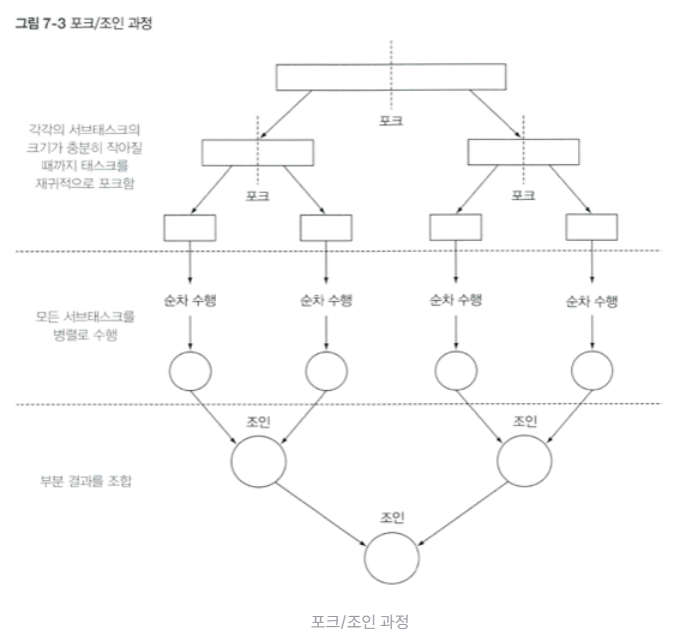
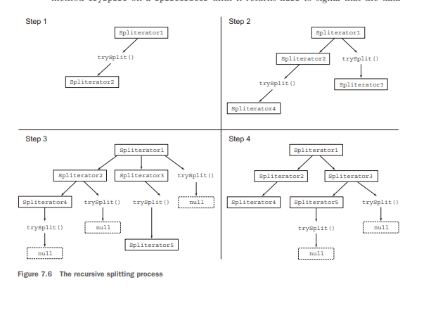

# CHAPTER 7. 병렬 데이터 처리와 성능

자바 7 이전의 데이터 컬렉션을 병렬 처리할 때 단계는 다음과 같다. 
아래의 과정은 자바 7 이후로 Fork/Join 프레임워크 기능을 통해 쉽게 병렬화를 수행하고 에러를 줄일 수 있다.

1. 데이터를 서브파트로 분할한다.
2. 분할된 서브파트를 각각의 스레드로 할당한다.
3. 스레드로 할당한 다음 의도하지 않은 레이스 컨디션이 발생하지 않도록 적절한 동기화를 추가한다.
4. 부분 결과를 합친다.

---

## 7.1.1 병렬 스트림
parallelStream을 호출하면 병렬 스트림이 생성된다. 병렬 스트림을 이용하면 모든 멀티코어 프로세서가 각각의 청크를 처리하도록
할당할 수 있다.

전통적인 자바 방식, result라는 스택에 할당된 변수를 통해 상태를 유지하고 n이 커졌을 때 처리속도가 느리다. 

```Java
public long iterativeSum(long n) {
    long result = 0;
    for (long i = 1L; i <= n; i++) {
        result += i;
    }
    return result;
}
```

병렬 스트림을 사용한 방법, 무한 스트림을 만들고 인수로 주어진 크기로 스트림을 제한해, 두 숫자를 더하는 리듀싱 작업을 수행한다.

```Java
public long sequentialSum(long n) {
    return Stream.iterate(1L, i -> i + 1)
            .limit(n)
            .reduce(0L, Long::sum);
}
```

위의 구문은 간단하게 parallel 메서드를 호출하면 기존의 함수 리듀싱 연산이 병렬로 처리된다.

```Java
public long sequentialSum(long n) {
    return Stream.iterate(1L, i -> i + 1)
            .limit(n)
            .parallel()
            .reduce(0L, Long::sum);
}
```

위의 parallel 메서드를 호출했을 때 스트림 자체에는 변화가 없다. 
하지만 parallel을 호출하면 병렬로 수행해야 함을 의미하는 불리언 플래그가 설정된다.

반대로 sequential로 병렬 스트림을 순차 스트림으로 바꿀 수 있다. 이를 통해 어떤 연산을 병렬로 실행하고 어떤 연산을 순차로 실행할 지 제어가 가능하다.
단, 최종적으로 호출된 메서드가 전체 파이프라인에 영향을 줌을 기억하자.

### 병렬 스트림에서 사용하는 스레드 풀 설정
병렬 스트림은 내부적으로 ForkJoinPool을 사용한다. 기본적으로 ForkJoinPool은 프로세서 수에 상응하는 스레드 값을 가진다.
일반적으로 기기의 프로세서 수와 같으므로 특별한 이유가 없으면 ForkJoinPool의 기본 값을 그대로 사용한다.

```Java
System.setProperty("java.util.concurrent.ForkJoinPool.common.parallelism", "12");
```

## 7.1.2 스트림 성능 측정

병렬 버전으로 처리를 할 때 멀티 코어 CPU를 사용하지 못하고 순차 버전에 비해 느린 결과가 나올 수 있는 이유는 아래와 같다.
- 반복의 결과로 박싱된 객체가 만들어지기에 숫자를 더하려면 언박싱을 해야 한다.
- 반복 작업은 병렬로 수행할 수 있는 독립 단위로 나누기가 어렵다.

특히 반복작업은 이전 연산에 따라서 다음 함수의 입력이 달라지기 때문에 iterate 연산을 청크로 분할하기 어렵다.
리듀싱 과정을 시작하는 시점에 전체 스트림을 병렬로 처리할 수 있도록 청크를 분할할 수 없어 리듀싱 연산이 나뉘어져 수행되지 않는다.
그래서 결과적으로 순차처리 방식과 다르지 않은데 병렬 처리를 위해 스레드를 할당하는 비용만 올라가 느린 결과가 나오게 된다.

위의 코드는 iterate 과정을 거치면서 요소가 생성되므로 리듀싱 과정을 시작하는 시점에 전체 숫자 리스트가 준비되어 있지 않으므로
스트림을 병렬로 처리할 수 있도록 청크로 분할하지 못한다. 그렇기에 순차처리 방식과 다르지 않으며 쓰레드 할당 오버헤드만 증가했다.
또한 특화스트림이 아니기에 박싱 비용과 언박싱 비용이 추가돼서 느리다.

```Java
public long sequentialSum(long n) {
    return Stream.iterate(1L, i -> i + 1)
            .limit(n)
            .parallel()
            .reduce(0L, Long::sum);
}
```

멀티 프로세서를 병렬에서 효과적으로 쓰려면 iterate를 rangeClosed 메서드로 변경하는 방법을 사용할 수 있다. 
해당 메서드는 iterate에 비해 다음과 같은 장점이 있다.

- LongStream.rangeClosed는 기본형 long을 직접 사용하기에 박싱과 언박싱 오버헤드가 사라진다.
- LongStream.rangeClosed는 쉽게 청크로 분할할 수 있는 숫자 범위를 생산한다. 예를 들어 1-20 범위의 숫자를 1-5, 6-10, 11-15, 16-20
범위의 숫자로 분할할 수 있다.

따라서 아래의 코드는 앞의 코드보다 훨신 빠르며 순차처리보다 약간 더 빠르다.

```Java
public static long parallelRangedSum(long n) {     
    return LongStream.rangeClosed(1, n)
                     .parallel()
                     .reduce(Long::sum)
                     .getAsLong();
}
```
병렬화가 성능적인 향상을 가져다주지만 병렬화를 거침으로써 오히려 비용이 증가하는 것도 있으며 목록은 아래와 같다.
- 스트림을 재귀적으로 분할하는 비용
- 서브스트림을 서로 다른 스레드의 리듀싱 연산으로 할당하고 합치는 비용
- 멀티코어 간 데이터 이동 비용

## 7.1.3 병렬 스트림의 올바른 사용법
병렬처리에서 조심할 점은 공유된 상태를 바꾸는 알고리즘을 사용하는 것이다. 
아래의 n까지의 자연수를 더하며 공유된 누적자를 바꾸는 프로그램은 순차 실행하게 구현되어있는 문제가 있다.

아래의 코드를 병렬로 실행할 시 total에 접근할 때 데이터 레이스 문제가 발생한다. 동기화로 문제를 해결하면 병렬의 특징을 잃는다.

```Java
public static long sideEffectSum(long n) {
    Accumulator accumulator = new Accumulator();
    LongStream.rangeClosed(1, n).forEach(accumulator::add);
    return accumulator.total;
}
public static class Accumulator {
    private long total = 0;
    public void add(long value) {
        total += value;
    }
}
```

그래서 아래의 코드는 실행해보면 올바른 결과값인 50000005000000이 아닌 실행에 따라 다른 틀린 값이 나오게 된다.

```Java
public long sideEffectParallelSum(long n) {
    Accumulator accumulator = new Accumulator();
    LongStream.rangeClosed(1, n).parallel().forEach(accumulator::add);
    return accumulator.total;
}
public static void main(String[] args) {
    System.out.println("SideEffect parallel sum done in: " +
            measurePerf(parallelStreams::sideEffectParallelSum, 10_000_000L) + "msecs");
}
```

## 7.1.4 병렬 스트림 효과적으로 사용하기
병렬 스트림을 사용할 때 모던 자바 인 액션의 저자는 아래와 같은 기준을 제시한다.
- 확신이 서지 않으면 직접 측정하라. 어떤 게 좋을 지 모르겠다면 적절한 벤치마크로 직접 성능을 측정해라.
- 박싱을 주의해라. 되도록 기본 특화 스트림을 써서 처리해라.
- 순차 스트림보다 병렬 스트림에서 성능이 떨어지는 limit, findFirst 같이 순서에 의존하는 연산은 병렬 스트림에서 더 비싼 비용을 지불해야 한다.
- 하나의 소요를 처리하는 비용이 커졌을 때 병렬 스트림으로 성능을 개선할 가능성이 크다.
- 소량의 데이터는 병렬처리에서 이득을 얻기 힘들다.
- 스트림을 구성하는 자료구조가 적절한지 확인해야 한다. ArrayList는 요소 탐색이 없어도 분할이 가능하지만 LinkedList는 그렇지 않다.
- 스트림의 특성과 파이프라인 중간 연산이 스트림의 특성을 어떻게 바꾸는지 생각해라. 필터 연산 같은 건 스트림 연산을 예측하기 어렵게 한다.
- 최종 연산의 병합 비용이 너무 크면 병렬 과정에서 얻은 이득이 결합 과정 비용 증가로 상쇄될 수 있다.

스트림 소스의 분해성

| 소스 | 분해성 |
|---|---|
| ArrayList | 훌륭함 |
| LinkedList | 나쁨 |
| IntStream.range | 훌륭함 |
| Stream.iterate | 나쁨 |
| HashSet | 좋음 |
| TreeSet | 좋음 |

---

# 7.2 포크/조인 프레임워크

포크/조인 프레임워크는 병렬화할 수 있는 작업을 분할한 다음 서브태스크 각각의 결과를 만든다. 포크/조인 프레임워크에서는 ExecutorService 인터페이스를 구현한다.

## 7.2.1 RecursiveTask 활용

스레드 풀을 사용하기 위해 RecursiveTask<R>의 서브 클래스를 만들어야 한다. R은 병렬 작업을 재귀적으로 호출한다는 의미로 RecursiveTask 호은 RecursiveAction을 의미한다.
둘의 차이는 파라미터 상에 전달되는 게 있으며 Task 없으면 Action으로 취급하면 된다.

RecursiveTask를 정의하려면 추상 메서드 compute를 구현해야 한다.

```Java
protected abstract R compute();
// 슈도 코드
if (작업의 크기가 충분히 작다면)
    작업을 직접적으로 실행
else {
    작업을 둘로 분할
    재귀적으로 호출하여 두 작업을 병렬적으로 실행
    분할된 작업이 완료될 때까지 기다리고 합침.
}
```

포크/조인 과정 - 병합 정렬이나 세그트리랑 비슷한 거 같습니다.



포크/조인 병렬 합계 수행 코드 예시

```Java
@Override
protected Long compute() {
    int length = end - start;
    if (length <= THRESHOLD) { // 기준 값보다 작으면 순차적인 값으로 처리를 한다.
        return computeSequentially();
    }
    // 작업을 왼쪽과 오른쪽으로 나눔.
    var leftTask = new ForkJoinSumCalculator(numbers, start, start + length/2);
    leftTask.fork(); 
    var rightTask = new ForkJoinSumCalculator(numbers, start + length/2, end);
    Long rightResult = rightTask.compute();
    Long leftResult = leftTask.join();
    return leftResult + rightResult;
}

private long computeSequentially() {
    long sum = 0;
    for (int i = start; i < end; i++) {
        sum += numbers[i];
    }
    return sum;
}

public static long forkJoinSum(long n) {
    long[] numbers = LongStream.rangeClosed(1,n).toArray();
    ForkJoinTask<Long> task = new ForkJoinSumCalculator(numbers);
    return new ForkJoinPool().invoke(task);
}
```

※ 여기서 fork가 뭔지 궁금해서 살펴보니 ForkJoinTask는 공유 풀을 가지고 있어서 해당 공간에 밀어넣는
작업이고 left는 이후에 다른 워커 쓰레드에 의해 compute()가 호출되면서 처리가 되는 거 같더라고요.
그리고 Join은 개별 태스크가 끝날 때까지 기다리는 작업이고 그 이후에 결과를 합친다고 하네요. 

위의 코드 중 맨 아래 코드가 실질적인 작업 부분인데 invoke 메서드를 통해서 분할된 작업을 시행을 한다고 하네요.

특히 ForkJoinPool은 싱글턴으로 사용이 되는데, JVM에서 모든 프로세서가 자유롭게 풀에 접근을 할 수 있습니다.
그리고 Runtime.availableProcessors의 반환 값으로 풀에 사용할 스레드를 결정을 하되. 
하이퍼스레딩과 관련된 가상 프로세서의 개수도 포함이 된다고 합니다.

※ 하이퍼스레딩과 가상 프로세서는 실제로 코어 개념이 아닌 논리적인 코어로 알고 있습니다. 
CPU 당 1개의 프로세스, 쓰레드를 할당하게 처리를 하면 CPU를 100%활용하지 못해서 가상화해서
자원을 할당하고 최대한 CPU 자원의 자원을 사용하게 만드는 방법으로 알고 있습니다. 

대신 스케줄링할 때 실제로 돌아갈 땐 가상으로 코어당 2개씩 할당하고 돌린다고 하네요.

## 7.2.2 포크/조인 프레임워크 제대로 사용하는 방법
- join 메서드를 태스크에 호출하면 태스크가 생성하는 결과가 준비될 때까지 호출자를 블록시킨다.
두 서브 태스크가 시작된 다음 join을 호출해야 한다. 안 그러면 순차적처럼 돌아간다.
- RecursiveTask 내의 invoke 메서드는 태스크를 즉시 실행하고 결과를 반환하는 동작을 수행하며 동기적으로 실행하고 싶을 때 사용하기에 직접 호출해선 안된다.
따라서 compute나 fork 메서드 같이 비동기적으 처리할 수 있는 메서드를 호출해야 한다.
- 두 개의 서브태스크로 나뉘어졌을 때 한 쪽은 fork(), 한 쪽은 compute를 호출하는 게 효율적이다. 한 태스크는 같은 스레드를 재사용할 수 있다.
- 포크/조인 프레임워크는 스택 트레이스로 디버깅이 어렵다.
- 병렬 처리가 빠른 전제는 태스크를 독립적인 서브태스크로 분할할 수 있어야하고 충분히 실행시간이 커야한다.

## 7.2.3 작업 훔치기

서브태스크의 분할의 최종 크기를 결정하는 건 기준 값을 바꿔가며 실험해보는 것 외에는 방법이 없다. 
또한 실제 환경에선 예기치 않게 디스크 속도 저하가 되거나 외부 서비스와 협력하는 과정에서도 지연이 생길 수 있기 때문에 각각의 서브태스크 작업 완료 시간이
예상과 크게 달라질 수 있다.

그래서 포크/조인 프레임워크에선 작업 훔치기라는 기법으로 이 문제를 해결한다. 각각의 스레드는 자신에게 할당된 태스크를 포함하는 이중 연결리스트를 참조하다가
작업이 끝날 때 큐의 헤드에서 다른 태스크를 가져와 작업을 처리한다. 이 때 빨리처리한 쓰레드는 쉬는 것이 아니라 다른 스레드의 큐의 꼬리에서 작업을 가져와 처리하며
모든 태스크가 끝날 때까지 반복된다.

ForkJoinTask에선 서로 공유하는 global entry queue가 있고 local worker queue 이렇게 두 개가 있습니다. 작업을 분할하는 과정에서
WorkerThread일 때는 본인 작업 큐에 넣고 아니면 글로벌 큐에 넣고 작업을 합니다.

```Java
public final ForkJoinTask<V> fork() {
    Thread t;
    if ((t = Thread.currentThread()) instanceof ForkJoinWorkerThread)
        ((ForkJoinWorkerThread)t).workQueue.push(this);
    else
        ForkJoinPool.common.externalPush(this);
    return this;
}
```

그리고 작업에서 get 함수를 보니까 timeout도 ForkJoinTask에서 설정해서 작업할 수 있는 것 같습니다.

---

# 7.3 Spliterator 인터페이스

인터페이스 구조
```Java
public interface Spliterator<T> {
    boolean tryAdvance(Consumer<? super T> action); // 내부 요소 소비한 후 탐색할 요소 남았으면 참 반환
    Spliterator<T> trySplit(); // 두 번째 spliterator 생성
    long estimateSize(); // 탐색해야 할 요소 개수 정보 확인
    int characteristics(); // 작업 특성 메타데이터
}
```

## 7.3.1 분할 과정

스트림을 여러스트림으로 분할하는 과정은 재귀적으로 일어나며 trySplit을 호출하면 그 다음 Spliterator가 생성된다.
이 작업이 끝나는 건 설정한 작업의 최소 크기 설정보다 작아 trySplit의 결과가 null일 때까지 이 작업을 반복한다.



### Spliterator 특성
Spliterator는 특성 집합을 포함하는 int를 통해 특성을 참고해 제어하고 최적화한다.

| 특성        | 의미                                       |
|-----------|------------------------------------------|
| ORDERED   | 요소에 정해진 순서가 있어 요소 탐색과 분할에 있어서 유의해야 한다.   |
| DISTINCT  | 같은 요소가 존재하지 않는다.                         |
| SORTED    | 탐색된 요소는 미리 정의된 정렬 순서를 따른다.               |
| SIZED     | estimatedSize가 정확한 값을 반환한다.              |
| NONNULL   | 탐색하는 모든 요소는 null이 아니다.                   |
| IMMUTABLE | 소스가 불변이라 요소를 탐색하는 동안 요소 추가, 삭제, 변경이 안된다. |
| CONCURRENT | 동기화 없이 여러 스레드에서 고칠 수 없다. |
| SUBSIZED | 현재 Spliterator와 하위 모두 SIZED 특성을 갖는다. |

---

## 7.3.2 커스텀 Spliterator 구현하기

```Java
// 문자를 하나하나 살피면서 공백을 만나면 단어로 취급하는 방식
public WordCounter accumulate(Character c) {
    if (Character.isWhitespace(c)) {
        return lastSpace ? this : new WordCounter(counter, true);
    } else {
        return lastSpace ? new WordCounter(counter + 1, false) : this;
    }
}
// 결과에서 단어 개수를 합침.
public WordCounter combine(WordCounter wordCounter) {
    return new WordCounter(counter + wordCounter.counter, wordCounter.lastSpace);
}

// 전체 스트림에서 reducing 연산으로 문장 내의 단어 수를 찾음.
private static int countWords(Stream<Character> stream) {
    WordCounter wordCounter = stream.reduce(new WordCounter(0, true),
                                            WordCounter::accumulate,
                                            WordCounter::combine);
    return wordCounter.getCounter();
}

// 아래 코드에서 실행은 Stream이 나뉠 때 임의로 나뉘어지기 때문에 단어의 중간을 나눠 실제보다 더 많은 단어가 출력됨.
Stream<Character> stream = IntStream.range(0, sentence.length())
                                    .mapToObj(sentence::charAt);
System.out.println("Found " + countWords(stream) + " words");
System.out.println("Found " + countWords(stream.parallel()) + " words");
```

위의 countWords는 stream을 받아서 reducing 작업을 한다. accumulate는 문자 하나하나 살펴 마지막에 공백을 만나면 단어로 취급하는 방식으로 동작하며
combine은 두 WordCounter의 counter 값을 더하는 역할을 한다.

위의 코드의 문제점은 stream을 병렬처리를 위해 분할하는 과정에서 자동적으로 분할할 때 Stream<Character>가 임의로 나뉘기 때문에 단어의 중앙에서 분할이 일어난다.
그래서 아래의 countWords(stream.parallel()) 코드에서 병렬처리 과정에서 문제가 생겨 실제보다 더 큰 결과값이 나온다.

### WordCounter 병렬로 수행하기

위와 같은 경우 임의로 작업을 분할하지 못하게 작업 분할을 직접 정의를 해주어야 한다. 그러기 위해선 Spliterator 인터페이스를 정의해야 한다.

```Java
@Override
public boolean tryAdvance(Consumer<? super Character> action) {
    action.accept(string.charAt(currentChar++));
    return currentChar < string.length();
}

@Override
public Spliterator<Character> trySplit() {
    int currentSize = string.length() - currentChar;
    if (currentSize < 10) { // 충분히 작아지면 순차처리를 알리는 null 반환
        return null;
    }
    // 작업을 분할하기 전에 공백까지 이동시켜 단어 중앙에서 분리가 일어나는 것을 방지함.
    for (int splitPos = currentSize / 2 + currentChar; splitPos < string.length(); splitPos++) { 
        if (Character.isWhitespace(string.charAt(splitPos))) {
            Spliterator<Character> spliterator =
                    new WordCounterSpliterator(string.substring(currentChar, splitPos));
            currentChar = splitPos;
            return spliterator;
        }
    }
    return null;
}

@Override
public long estimateSize() {
    return string.length() - currentChar;
}

// 작업의 메타데이터 정보
@Override
public int characteristics() {
    return ORDERED + SIZED + SUBSIZED + NONNULL + IMMUTABLE;
}
```

- tryAdvance 메서드는 문자열에서 현재 인덱스에 해당하는 문자를 Consumer에 제공한 뒤 인덱스를 증가시킨다. 
이 메서드의 목적은 반복탐색해야 할 문자가 남아있는 지를 확인하는 용도이다.
- trySplit은 반복될 자료구조를 분할하는 로직을 포함한다. 분할할 한계를 위에선 10으로 했지만 실제에선 직접 측정해보며 결정해야 한다.
위에서 주석을 단 부분을 통해 단순히 작업을 인덱스 절반 나누어서 처리하는 것이 아닌 단어 별로 끊어 단어 중앙에서 끊어버려 중복된 count가 세는 것을
방지하도록 지시하였다

기본적으로 제공하는 병렬처리 작업 방식이 작업에 따라 적합하지 않거나 비효율적일 수 있다는 점을 기억해야 할 것 같습니다.
항상 직접 문제에 대해서 동작을 시켜보고 작업을 분할한 뒤에 논리적으로 문제가 없는지 살펴보고 시간 측정 툴 같은 걸 통해 성능을 확인하면서 작업 분할 크기를
조정하는게 최선일 것 같습니다.